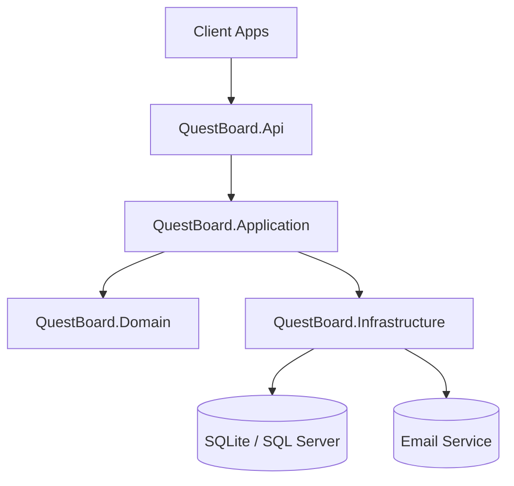

# QuestBoard API

[](https://github.com/Semir-Harun/QuestBoard-API/actions)
[](LICENSE)

> A Trello-style backend that powers collaborative project management with role-based access control, automated notifications, and rich task workflows.

## Highlights
- Role-aware JWT authentication with granular authorization policies (Admin, Manager, Member)
- Background email queue with retry semantics to keep collaborators updated
- File uploads with secure storage abstraction and static file serving
- Filtering, pagination, and soft-delete metadata baked into every resource endpoint
- AutoMapper-powered DTO mapping and structured logging via Serilog sinks

## Tech Stack


## Architecture


## API Preview


## Getting Started
```bash
git clone https://github.com/<you>/QuestBoard-API.git
cd QuestBoard-API
dotnet restore

# Configure secrets (JWT key & SMTP credentials)
dotnet user-secrets init --project QuestBoard.Api
dotnet user-secrets set "Jwt:Key" "<dev-secret>" --project QuestBoard.Api

# Apply database migrations
dotnet ef database update --project QuestBoard.Infrastructure --startup-project QuestBoard.Api

# Launch the API
dotnet run --project QuestBoard.Api
```

Open https://localhost:5001/swagger once the app is running.

> **Heads-up:** the project targets .NET 6. Install the .NET 6 SDK/runtime locally or use the Docker workflow below if you only have newer runtimes installed.

## Docker Quickstart
```bash
# Build and start the API (http://localhost:8080/swagger)
docker compose up --build

# Seed demo data inside the container
docker compose run --rm api dotnet QuestBoard.Api.dll seed
```

The compose file mounts `./data` into the container so the SQLite database persists between runs.

## Demo Data (optional)
```bash
dotnet run --project QuestBoard.Api -- seed
```

The seed operation provisions an `Admin` user, a sample project, and a set of tasks.

- Admin login: `admin@questboard.local`
- Password: `QuestBoard!123`

## Project Layout
- `QuestBoard.Api` – Presentation layer with controllers, filters, middleware, and Swagger setup
- `QuestBoard.Application` – Application services, DTOs, policies, and abstraction contracts
- `QuestBoard.Domain` – Core entities, enums, and domain invariants
- `QuestBoard.Infrastructure` – EF Core persistence, auth, file storage, email background jobs
- `QuestBoard.Tests` – xUnit test suites covering API/Application/Infrastructure layers
- `docs/` – Mermaid diagrams and portfolio-friendly screenshots (generate `.png` files from the `.mmd` sources)
- Tip: `npm install -g @mermaid-js/mermaid-cli` then run `mmdc` to export the diagrams into PNGs before pushing to GitHub
- `Dockerfile` / `docker-compose.yml` – containerized developer experience targeting .NET 6
- Using Mermaid diagrams as living documentation to communicate architecture and workflows

## Testing
```bash
dotnet test
```

CI runs the same command on every push and pull request via `.github/workflows/ci.yml`.

## Roadmap
- [ ] Feature: Harden JWT setup with refresh tokens and improved onboarding flow
- [ ] Feature: Expand Project and Task services with richer filtering and reports
- [ ] Feature: Add CRUD endpoints and DTOs for full backlog management
- [ ] Chore: Centralize logging with Serilog sinks for console + Seq
- [ ] Test: Introduce focused xUnit coverage for `TaskService`
- [ ] Docs: Publish real Swagger screenshot and architecture graphic under `docs/`
- [ ] Ops: Tag releases (e.g., `v1.0.0`) once the MVP milestone lands

## What I Learned
- Designing a layered architecture that keeps the Domain model persistence-agnostic
- Wiring JWT authentication with policy-based authorization for clean RBAC
- Orchestrating background jobs for email notifications without blocking API requests
- Using AutoMapper profiles to keep controllers lean and focused on contracts
- Leaning on Serilog enrichers to surface actionable telemetry for debugging
- Containerizing the API with multi-stage Docker builds and compose for frictionless demos

## Release Management
```bash
git tag -a v1.0.0 -m "QuestBoard API initial release"
git push origin v1.0.0
```

Tags demonstrate maintainership and provide clear milestones for recruiters and collaborators.

## Contributing
Pull requests are welcome! Please open an issue first to discuss significant changes so we can align on scope.

## License
Distributed under the MIT License. See `LICENSE` for details.
